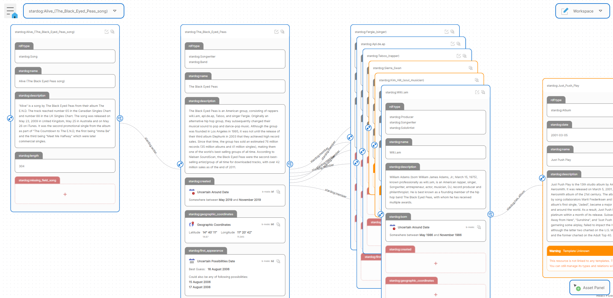

# SemanticFlow

SemanticFlow is a Web solution for visual RDF graphs editing.

Can adapt to varied use cases thanks to its template configuration. Configuring a template allows you to define the structure of the RDF resources and properties managed by the tool. Thus, the user can intuitively edit graphs of any nature. The user is assisted by a set of attribute editors that allow simple and intuitive data editing experience.

Includes advanced functionalities allowing spatio-temporal data management adapted to the needs of research on the history of Swiss territorial control.

RDF data manipulation is done via SPARQL query language. SPARQL, a W3C standard, is a reference in the RDF field. Our solution is therefore compatible with many existing RDF data sources.

# Motivations
Since Semantic Web ontologies are often overly complex, the objective is to configure the editor using templates to edit the RDF graph intuitively.

Configuring a template allows the user's view of the graph to be reduced to the resources and properties of interest. Editing large RDF graphs thus becomes much more ergonomic.

# Quick start /docker
    
    docker compose build
    docker compose up

Will run the docker-compose file and start both Apache Jena Fuseki and SemanticFlow.

# Installation instructions /without docker
Please refer to [detailed installation](./documentation/detailed-installation.md) instructions.

# Setup the RDF dataset
Both Dockerized and non-Dockerized installations will run Apache Jena with an empty dataset named `ds`. 

Apache Jena UI console is accessible via http://localhost:3030/. 

The dataset `/ds` should be available in the list. Apache Jena offers several endpoints per dataset. The rdf editor is configured to use the dataset called `ds`, if you change this configuration, please name the dataset accordingly.

### Add data into the dataset
Once the dataset is ready, click on `add data` and select `musici.ttl` from `./data`. That dataset originates from Stardog and contains 50 000 triples. 

SemanticFlow do not require any data to be loaded in the dataset. This part is not required. You can run the editor on an empty dataset as well.

# SemanticFlow User Manual
Please refer to [user manual](./documentation/semantic-flow-user-manual.md).

# Configuration
- [SemanticFlow editor configuration](./documentation/semantic-flow-configuration.md)
- [SemanticFlow template configuration](./documentation/template-configuration.md)

# Contents

    - ./web : SemanticFlow RDF editor. 
    - ./documentation : SemanticFlow documentation.
    - ./docker/jena-fuseki : Dockerfile for Apache Jena Fuseki . 
    - ./data : importable RDF data.
    