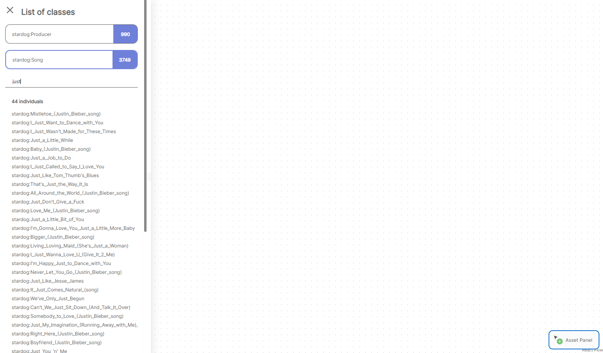
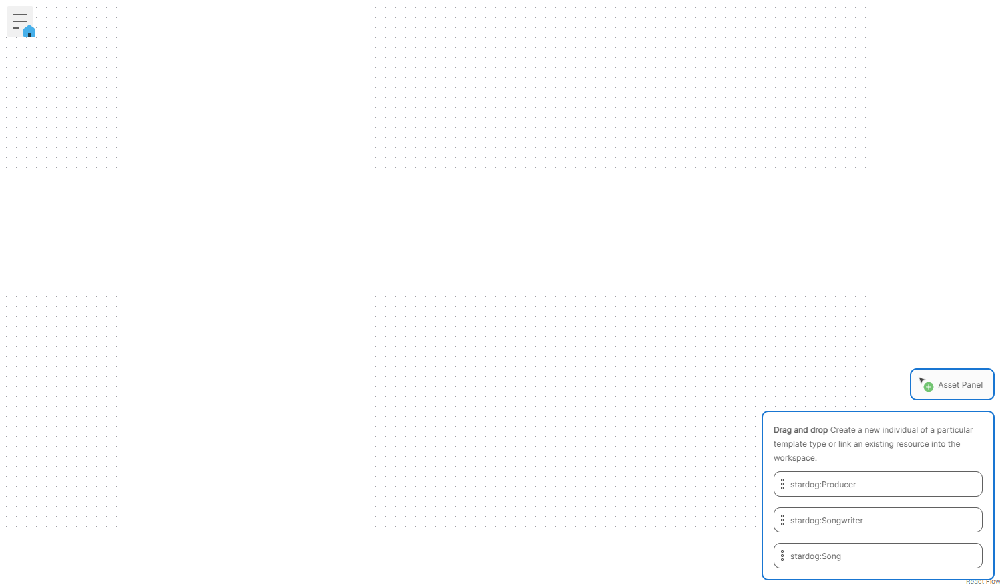
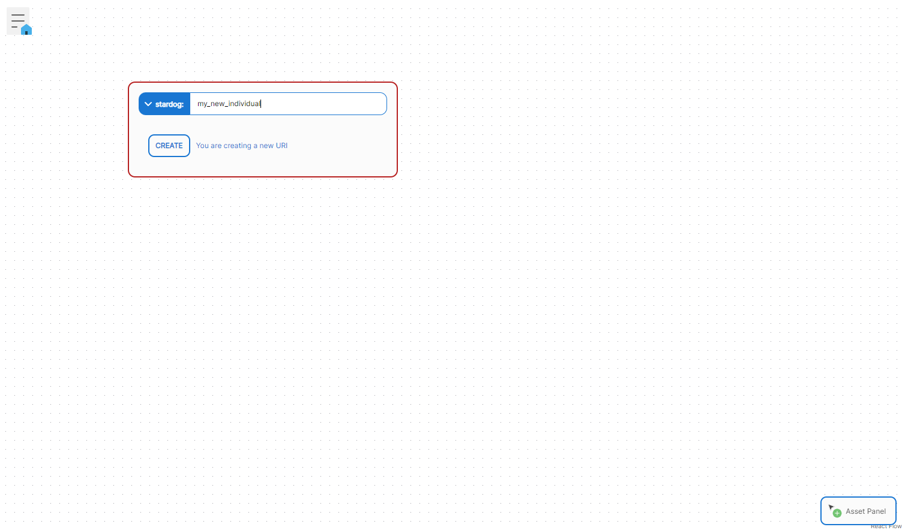
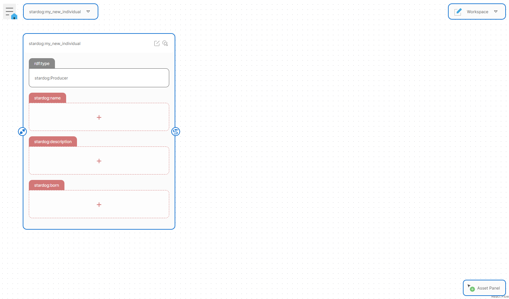
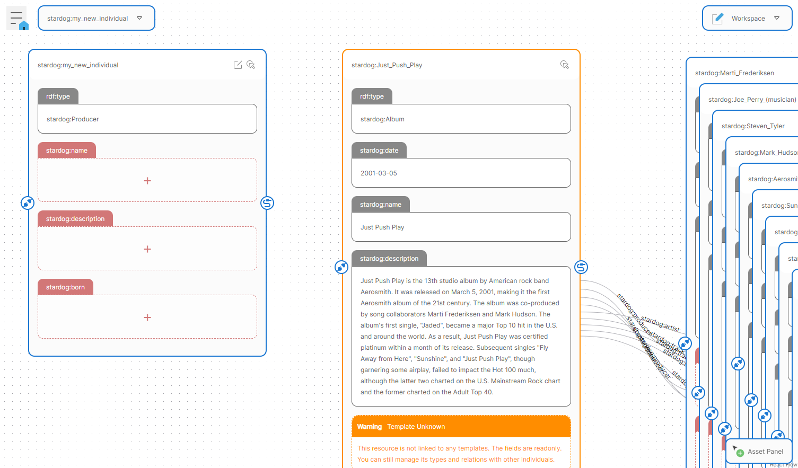
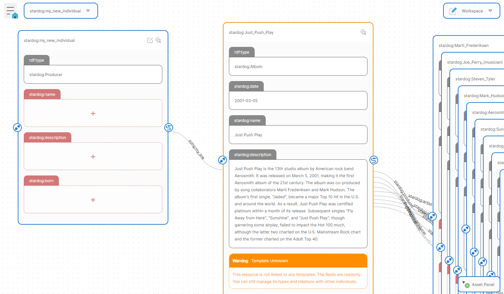

# SemanticFlow User Manual

## Scope

The following documentation focuses on how to use the SemanticFlow editor. The editor is configured to work with the `./data/music.ttl` stardog's dataset through out this document.

## Overview

SemanticFlow editing interface, called `workspace`, allows to graphically manage RDF graphs. It has a set of features that allow the user to create individuals, to edit their properties and to manage links between them.

## How to do it

We will follow consecutive steps shown as an ordered list to demonrate how to use the editor. 

## Open an existing individual

1. When you first enter into SemanticFlow editor, you will see a blank workspace. 

2. A home button on the top left corner of the workspace allows to open the collapsible search menu. This menu allow you to find an individual that have particular type. 

4. By clicking on the individual from the search result you set him as the root of your workspace. The individual is added into the active individuals dropdown. 

### Create new individual

1. The asset panel, at bottom right corner in the workspace, is a collapsible panel that allows you to add new or existing individuals to the workspace. It displays the list of classes configured in the template.

2. Drag and Drop an individual from the asset panel to the workspace. 

3. Specify the individuals URI and click on CREATE. 

### Link existing resource into the workspace

1. Drag and Drop an individual from the asset panel onto the workspace, the same way we did during the new individual creation.

2. When typing the individual's URI, you will see a list of resources that match the query. You can either type the full URI of an existing resource or just click on any proposal from the list.

3. Click on the LINK button to add the individual to the workspace.

4. Drap and Drop from the source handle to the target handle to link the individual to the target resource.

5. Type the predicate URI and click on SAVE. 

 

